# Folded-Fairy

[Access the live site here.](https://melody-lisa.github.io/Folded-Fairy/)

This is the documentation for The Folded Fairy. The site has been built using HTML5 & CSS3 with minor javascript elements created through the use of Bootstrap for the Milestone 1 project for Code Institute's web development diploma.

******

## User Experience (UX)

### Strategy

 This project is inspired by a real creative project with the aim to show the owner of these creations an idea of what it would look like to expand their independent business with a simple website that showcases their portfolio along with allowing potential customers to contact them via social media or directly through the website.

- #### User Stories

  * __First Time Visitor Goals__

    a. As a first time visitor, I want to be able to easily understand the purpose of the website and to learn more about the business.
    
    b. As a first time visitor, I want to be able to easily navigate the site to access content without having to use the back button at any time.
    
    c. As a first time visitor, I want to look for testimonials to understand what their users think of them and see if they are trusted. I also want to locate their social media links to see their followings on social media to determine how trusted and known they are.

  * __Returning Visitor Goals__

    a. As a returning visitor, I want to be able to see new creations made by the business to see how often they are creating products.
    
    b. As a returning visitor, I want to know how to contact the business for more information if I wanted a design of my own.

  * __Frequent User Goals__
    
    a. As a frequent user, I want to see new creations made by the business.
    
    b. As a frequent visitor, I want to be able to check for new features as the website expands.

-----

### Scope

Taking all of the above into account I decided that we would need three main pages to begin with;

* __Home Page:__ This would provide users with information about the business along with some reviews about the products that they sell.
* __Gallery Page:__ This would showcase some of the products previously created by the business for users to scroll through.
* __Contact Page:__ This would allow users to ask for more information or get a quote on a custom design of their choosing.

As well as the three main pages, links to the business' social media pages would be clearly shown in the footer to direct users to other sites that the business is active on.

These three pages give the client a good starting idea about the potential for having their own website with room to expand the site to include more features in the future.

-----

### Structure

As the site is starting out quite simply, the navigation route will be linear and will encourage users to read about the business, view some of the past products and then contact the business for more information. This will be the order that the pages appear in the navigation bar along with interactive calls to action and links within the content of the pages to encourage users to click over to the next area of the site.

-----

### Skeleton

#### Wireframes

Folded Fairy Full Responsive Wireframes

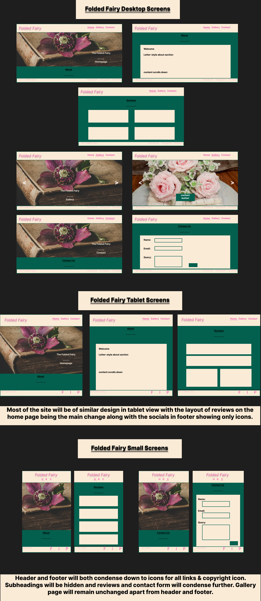

-----

## User Interface (UI) Design

### Surface

#### Typography

Fonts have been imported from [Google Fonts](https://fonts.google.com/).

* The [Luxurious Script](https://fonts.google.com/specimen/Luxurious+Script?query=luxuriou) font has been used for the main title on each page along with subheadings and certain parts of the about section. "Cursive" is the fallback font in case the browser doesn't import the font correctly. I chose this style of font as I believe it compliments the style of the product.

* The [Montserrat](https://fonts.google.com/specimen/Montserrat?query=mont) font has been used for the main text across the site with "sans-serif" as fallback if the browser doesn't import the font correctly. This is a common font used in websites, is easy to read and provides good contrast with the title font.

#### Colours

Initial colourscheme ideas through Paletton

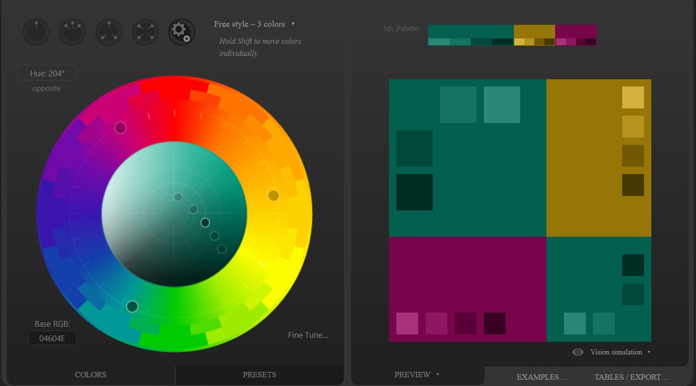

I used [Paletton](http://paletton.com/) to research a colourscheme for the site. Based on the overview of the site I knew we wanted to include a natural element in the colourscheme to represent the nature of the products, along with a hint of femininity that represents the client's personality.

Main colour scheme for the site

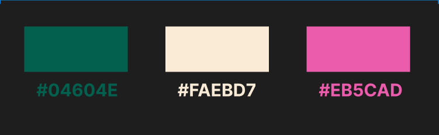

* __Antique White__ is the colour I chose for the background of various sections across the site. This was partly an accesibility choice that was made in the absence of a dark mode option. We wanted the site to appear light and airy without the harshness that can present with pure white. This slight off-white colour more closely fits with the yellow-tones that compliment the other colours in the triad without being distracting.

* __#04604E__ - This forest green is the colour I chose from using the paletton colour picker as the background for the entire page. It is bold but soft and contrasts well with the antique white to help highlight each section of the pages.

* __#EB5CAD__ - The original paletton triad pallet suggests a more purple-tone pink to go with the green. I decided I wanted something lighter and more feminine that would contrast with the deep colour of the green background. This shade of pink it used for elements in the header and footer along with various elements that require highlighting - including hover effects for buttons.

-------

## Features

### Site-Wide

Desktop Header

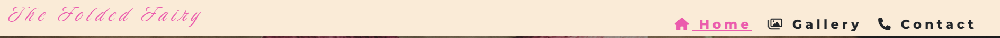

Mobile Header

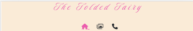

On larger screens the header's logo title sits at the left of the navbar and the navigation links sit on the right as HOME | GALLERY | CONTACT. On smaller screens the logo and links are pushed to the middle of the screen with the logo on top and icons representing each of the links sitting below.

Desktop Footer

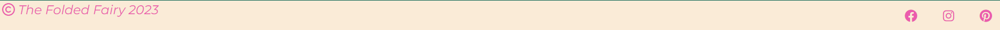

Mobile Footer

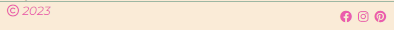

On larger screens the copyright information shows the copyright icon followed by "Folded Fairy 2023" to the left of the footer bar. On the right of the footer there are three socials icons for FACEBOOK | INSTRGRAM | PINTEREST. This layout remains relatively similar on smaller screens with only "2023" shown after the copyright symbol.

Hero Image Fade-in Animation

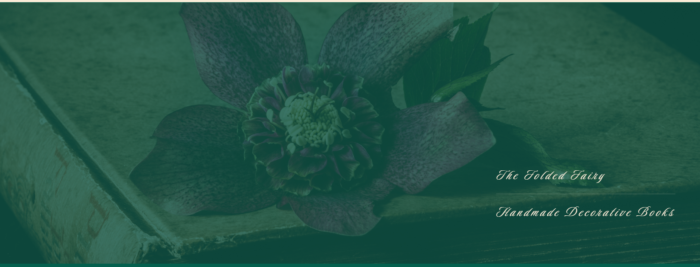

On the home and contact pages the hero image fades into view over 4 seconds using a keyframes animation. This has also been applied to the gallery carousel as the page loads.

### Home Page

About Section

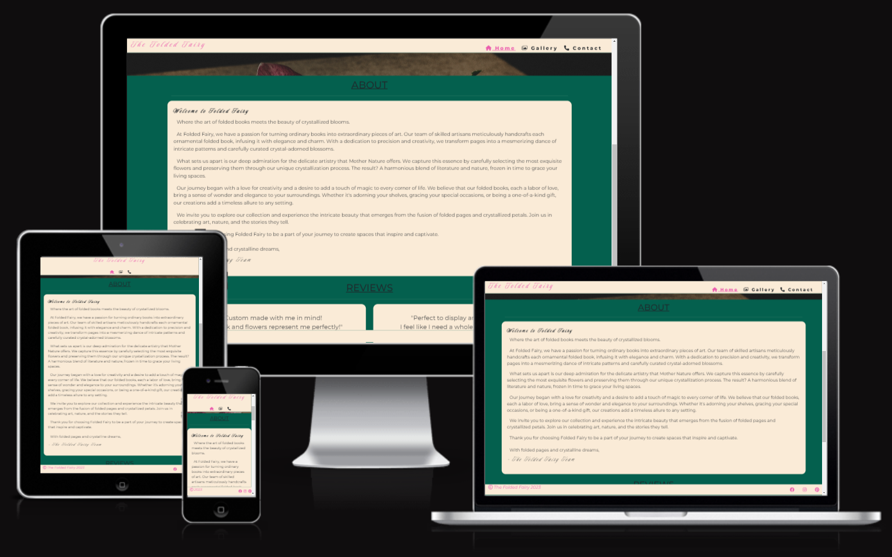

The about section is a simple box with letter-style content describing the business and what it's about. 

Responsive Reviews Section

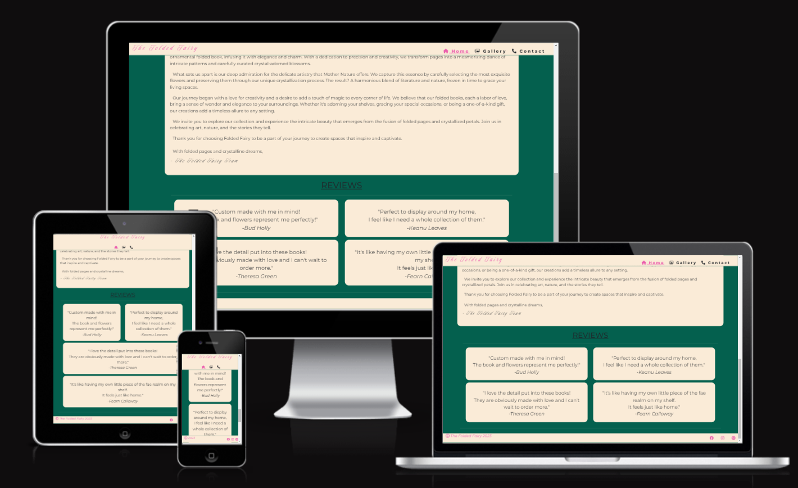

Using bootstrap's grid styling, the reviews section has a responsive layout that changes for three different breakpoints. On smaller screens the reviews stack one on top of the other, medium screens show two reviews side by side with two on their own lines, and on larger screens the reviews are shown two on top and two on the bottom.

### Gallery

Gallery Full Page Carousel

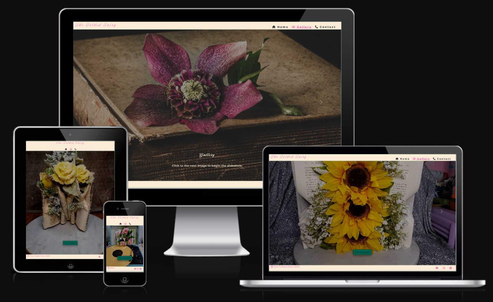

The carousel has an autoplay feature that requires user interaction before it starts. The first image that is shown as the page loads is the same as the hero image across the rest of the site for consistency. The positioning of this image is slightly different to the hero image on other pages, however, as the carousel is designed to fit the page without scrolling.

### Contact

Responsive Contact Form

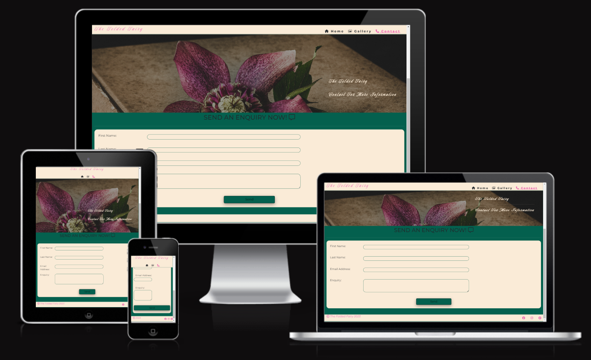

Coming Soon Modal

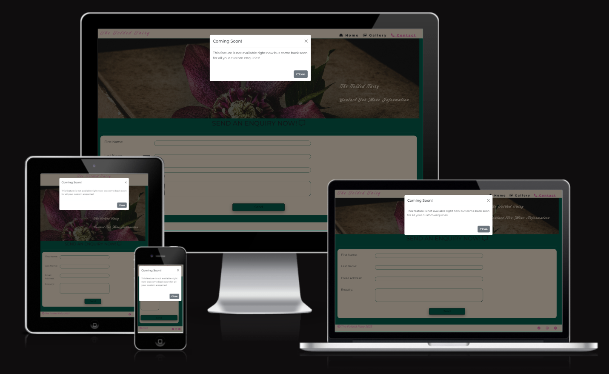

The contact form has a responsive design which pushes the input labels above the input field on small screen devices. If you click the submit button at this time a modal will appear indicating that the feature is not yet available and that it will be possible to use the contact form soon.

------

## Future Implementations

1. The next step in the creation of this website is to create functionality to the contact form. Due to the nature of this project, the html and css elements have been created with minimal javascript and back-end functionality.

2. The client has social media presence on platforms that are not featured on this version of the site. Due to their regular engagement with social media it may be beneficial to dedicate a page to featured videos and posts from various platforms.

-----

## Accessibility

### Alt Text

### Aria Labels

Aria labels have been 