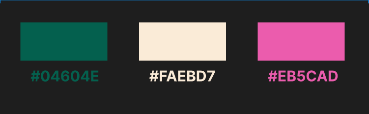

# Folded-Fairy - ReadME

[Access the live site here.](https://melody-lisa.github.io/Folded-Fairy/)

This is the documentation for The Folded Fairy. The site has been built using HTML5 & CSS3 with minor javascript elements created through the use of Bootstrap for the Milestone 1 project for Code Institute's web development diploma.

******

## Contents

* [User Experience (UX)](#user-experience---ux)
  * [Strategy](#strategy)
    * [User Stories](#user-stories)
  * [Scope](#scope)
  * [Structure](#structure)
  * [Skeleton](#skeleton)
* [User Interface (UI) Design](#user-interface---design)
  * [Typography](#typography)
  * [Colours](#colours)
* [Features](#features)
  * [Site-Wide](#site-wide)
  * [Home Page](#home-page)
  * [Gallery](#gallery)
  * [Contact](#contact)
* [Future Implementations](#future-implementations)
* [Accessibility](#accessibility)
  * [Alt Text](#alt-text)
  * [Aria Labels](#aria-labels)
  * [Colours](#colours-1)
  * [Fonts](#fonts)
* [Technologies Used](#technologies-used)
  * [Languages](#languages)
  * [Frameworks, Libraries, and Programs Used](#frameworks-libraries-and-programs-used)
* [Deployment & Local Development](#deployment--local-development)
  * [Deployment](#deployment)
  * [Local Development](#local-development)
    * [How to Fork](#how-to-fork)
    * [How to Clone](#how-to-clone)
* [Testing](#testing)
* [Credits](#credits)
  * [Code Used](#code-used)
  * [Content](#content)
  * [Media](#media)
  * [Achnowledgements](#acknowledgements)

[*Back to top*](#contents)

-----

## User Experience - UX

### Strategy

 This project is inspired by a real creative project with the aim to show the owner of these creations an idea of what it would look like to expand their independent business with a simple website that showcases their portfolio along with allowing potential customers to contact them via social media or directly through the website.

- #### User Stories

  * __First Time Visitor Goals__

    a. As a first time visitor, I want to be able to easily understand the purpose of the website and to learn more about the business.
    
    b. As a first time visitor, I want to be able to easily navigate the site to access content without having to use the back button at any time.
    
    c. As a first time visitor, I want to look for testimonials to understand what their users think of them and see if they are trusted. I also want to locate their social media links to see their followings on social media to determine how trusted and known they are.

  * __Returning Visitor Goals__

    a. As a returning visitor, I want to be able to see new creations made by the business to see how often they are creating products.
    
    b. As a returning visitor, I want to know how to contact the business for more information if I wanted a design of my own.

  * __Frequent User Goals__
    
    a. As a frequent user, I want to see new creations made by the business.
    
    b. As a frequent visitor, I want to be able to check for new features as the website expands.

[*Back to top*](#contents)

-----

### Scope

Taking all of the above into account I decided that we would need three main pages to begin with;

* __Home Page:__ This would provide users with information about the business along with some reviews about the products that they sell.
* __Gallery Page:__ This would showcase some of the products previously created by the business for users to scroll through.
* __Contact Page:__ This would allow users to ask for more information or get a quote on a custom design of their choosing.

As well as the three main pages, links to the business' social media pages would be clearly shown in the footer to direct users to other sites that the business is active on.

These three pages give the client a good starting idea about the potential for having their own website with room to expand the site to include more features in the future.

[*Back to top*](#contents)

-----

### Structure

As the site is starting out quite simply, the navigation route will be linear and will encourage users to read about the business, view some of the past products and then contact the business for more information. This will be the order that the pages appear in the navigation bar along with interactive calls to action and links within the content of the pages to encourage users to click over to the next area of the site.

[*Back to top*](#contents)

-----

### Skeleton

#### Wireframes

Folded Fairy Full Responsive Wireframes

All wireframes have been created with [Figma](https://figma.com/).

The wireframes featured here are the initial design idea for the webpage. Some styling elements have been changed since testing to improve accessibility as per suggestions through lighthouse as well as positioning changes in the reviews section after viewing the live site.

[*Back to top*](#contents)

-----

## User Interface - Design

### Surface

#### Typography

Fonts have been imported from [Google Fonts](https://fonts.google.com/).

* The [Luxurious Script](https://fonts.google.com/specimen/Luxurious+Script?query=luxuriou) font has been used for the main title on each page along with subheadings and certain parts of the about section. "Cursive" is the fallback font in case the browser doesn't import the font correctly. I chose this style of font as I believe it compliments the style of the product. I have made sure not to use it on any part of the site where information is provided for the user to ensure readability for any sections that require reading. 

* The [Montserrat](https://fonts.google.com/specimen/Montserrat?query=mont) font has been used for the main text across the site with "sans-serif" as fallback if the browser doesn't import the font correctly. This is a common font used in websites, is easy to read and provides good contrast with the title font.

#### Colours

Initial colourscheme ideas through Paletton

I used [Paletton](http://paletton.com/) to research a colourscheme for the site. Based on the overview of the site I knew we wanted to include a natural element in the colourscheme to represent the nature of the products, along with a hint of femininity that represents the client's personality.

Main colour scheme for the site

Colour scheme images made with [Figma](https://figma.com/).

* __Antique White__ is the colour I chose for the background of various sections across the site. This was partly an accesibility choice that was made in the absence of a dark mode option. We wanted the site to appear light and airy without the harshness that can present with pure white. This slight off-white colour more closely fits with the yellow-tones that compliment the other colours in the triad without being distracting.

* __#04604E__ - This forest green is the colour I chose from using the paletton colour picker as the background for the entire page. It is bold but soft and contrasts well with the antique white to help highlight each section of the pages.

* __#EB5CAD__ - The original paletton triad pallet suggests a more purple-tone pink to go with the green. I decided I wanted something lighter and more feminine that would contrast with the deep colour of the green background. This shade of pink it used for elements in the header and footer along with various elements that require highlighting - including hover effects for buttons.

[*Back to top*](#contents)

-------

## Features

### Site-Wide

Desktop Header

 

Mobile Header

 

On larger screens the header's logo title sits at the left of the navbar and the navigation links sit on the right as HOME | GALLERY | CONTACT. On smaller screens the logo and links are pushed to the middle of the screen with the logo on top and icons representing each of the links sitting below.

The navigation links on each page have an animated underline feature that expands from the left when hovered over and contracts to the right when the focus is removed.

Desktop Footer

Mobile Footer

On larger screens the copyright information shows the copyright icon followed by "Folded Fairy 2023" to the left of the footer bar. On the right of the footer there are three socials icons for FACEBOOK | INSTRGRAM | PINTEREST. This layout remains relatively similar on smaller screens with only the copyright symbol appearing on the left.

Hero Image Fade-in Animation

On the home and contact pages the hero image fades into view over 4 seconds using a keyframes animation. This has also been applied to the gallery carousel as the page loads.

### Home Page

About Section

The about section is a simple box with letter-style content describing the business and what it's about. 

Responsive Reviews Section

Using bootstrap's grid styling and card classes, the reviews section has a responsive layout that changes for three different breakpoints. On smaller screens the reviews stack one on top of the other, medium screens show two reviews side by side with the other two stacked below, and on larger screens the reviews are shown all on the same row. This differs slightly to my original wireframe due to the nature of the bootstrap classes I used to improve the overall look of the cards themselves.

### Gallery

Gallery Full Page Carousel

The carousel originally had an autoplay feature that required user interaction before it started but, after testing with a screen reader, this feature was removed. The first image that is shown as the page loads is the same as the hero image across the rest of the site for consistency. The positioning of this image is slightly different to the hero image on other pages, however, as the carousel is designed to fit the page without scrolling. There is an alert at the top of the page, prompting the user to get in contact. This alert can be dismissed by clicking the cross on the right hand side.

### Contact

Responsive Contact Form

FormDump

The contact form has a responsive design which pushes the input labels above the input field on small screen devices. If you click the submit button at this time the code institute formdump will appear indicating that the form has worked.

[*Back to top*](#contents)

------

## Future Implementations

1. After testing through lighthouse in the chrome developer tools, the next version of this website should focus on improving the performance highlighted through these tests.

2. The next step in the creation of this website is to create functionality to the contact form. Due to the nature of this project, the html and css elements have been created with minimal javascript and back-end functionality.

3. The client has social media presence on platforms that are not featured on this version of the site. Due to their regular engagement with social media it may be beneficial to dedicate a page to featured videos and posts from various platforms.

4. I had ideas to implement a horizontal scrolling feature for the reviews section to save on vertical scrolling, especially for mobile views, however I was not able to achieve this within the timeframe of this project. This is an option to look into in future versions of the site.

5. I believe the look of the gallery page could be improved, especially with how tempremental the styling for this has been during the development process. This was not achievable within the timeframe of the project, but is another option to look into in future versions of the site.

[*Back to top*](#contents)

-----

## Accessibility

### Alt Text

Alternative text has been included for all images across the site, including all images within the readme file.

### Aria Labels

Aria labels have been included for all links across the site, as well as the copyright icon in the footer.

### Colours

The colours across the site have been chosen with light sensitive users in mind. The client and I wanted the site to be light and airy with a lot of colour, without being harsh on the eyes. The colours chosen provide contrast that makes reading content easy while also creating a muted effect to reduce glare.

### Fonts

The main font is plain and easy to read. The cursive font used for the main heading and various sections throughout has been styled with extra letter spacing to make it easier to read.

[*Back to top*](#contents)

-------

## Technologies Used

### Languages

- HTML
- CSS

### Frameworks, Libraries, and Programs Used

* [Bootstrap V5.3](https://getbootstrap.com/) - The framework for the website. Code for the navigation bar, reviews, carousel and alert were used and modified. Additional CSS styling was also implemented in style.css.

* [Figma](https://figma.com/) - For wireframes and other graphics in readme.

* [Font Awesome](https://fontawesome.com/) - For the iconography on the website.

* Git - For version control.

* [Github](https://github.com/) - To save and store the files for the website.

* Google Dev Tools - To troubleshoot and test features, solve issues with responsiveness and styling.

* [Google Fonts](https://fonts.google.com/) - To import the fonts used on the website.

* [Pexels](https://pexels.com/) - For stock image.

* Samgsung Accessibility Settings - To test site with screen reader on mobile.

* [UI.dev](https://ui.dev/amiresponsive) - To show the site on a range of screen sizes.

[*Back to top*](#contents)

-------

## Deployment & Local Development

### Deployment

Github Pages was used to deploy the live website. The instructions to achieve this are below:

1. Log in (or sign up) to [Github](https://github.com/).
2. Find the repository for this project, [Folded-Fairy](https://github.com/Melody-Lisa/Folded-Fairy/).
3. Click on the Settings link.
4. Click on the Pages link in the left hand side navigation bar.
5. In the Source section, choose main from the drop down select branch menu. Select Root from the drop down select folder menu.
6. Click Save. Your live Github Pages site is now deployed at the URL shown.

### Local Development

* #### How to Fork

To fork the Folded-Fairy repository:

1. Log in (or sign up) to [Github](https://github.com/).
2. Go to the repository for [this project](https://github.com/Melody-Lisa/Folded-Fairy/).
3. Click the Fork button in the top right corner.

* #### How to Clone

To clone the Folded-Fairy repository:

1. Log in (or sign up) to [Github](https://github.com/).
2. Go to the repository for [this project](https://github.com/Melody-Lisa/Folded-Fairy/).
3. Click on the code button, select whether you would like to clone with HTTPS, SSH or GitHub CLI and copy the link shown.
4. Open the terminal in your code editor and change the current working directory to the location you want to use for the cloned directory.
5. Type 'git clone' into the terminal and then paste the link you copied in step 3. Press enter.

[*Back to top*](#contents)

-----

## Testing

Please see [testing.md](testing.md) for all testing elements of this site.

[*Back to top*](#contents)

-----

## Credits

### Code Used

* [30 Seconds of Code](https://www.30secondsofcode.org/css/s/hover-underline-animation/): Underline animations on the navigation links.

* [Bootstrap](https://getbootstrap.com/docs/5.3/components/card/): Insert the reviews cards on the home page.

* [Bootstrap](https://getbootstrap.com/docs/5.3/components/alerts/): Insert the alert on the gallery page.

* * [Bootstrap](https://getbootstrap.com/docs/5.3/components/carousel/): Insert the carousel on the gallery page.

* [ByteGrad](https://www.youtube.com/watch?v=zVjAA6UxvtU) - Youtube: Insert the carousel on the gallery page.

* [Code Institute](https://learn.codeinstitute.net/courses/course-v1:CodeInstitute+CSE101+2020_Q2/courseware/be0e510a3aca4bccb6e0bba4cf7cf06b/15fe9d557bcc4af5a117465b9150454f/) - Love Running Mini Project: Support with styling within style.css and code from the form challenge.

* [Code Institute](https://learn.codeinstitute.net/courses/course-v1:codeinstitute+FE+2017_T3/courseware/a4b90d17e5c94220a0f83f00ce7fa606/d2a9b1d3309349bba53e1debbe4c60a9/) - Introduction to Bootstrap: Support with styling through Bootstrap including how to use the grid system.

* [Jamie Juliver](https://blog.hubspot.com/website/css-fade-in#image-transition) - Blog: Fade In animation on hero image and carousel.

* [Stack Overflow](https://stackoverflow.com/questions/43949695/replace-text-in-menu-with-icon-in-small-screen-bootstrap): Using Bootstrap to hide and show elements of nav bar on different screen sizes.

* [Stack Overflow](https://stackoverflow.com/questions/2906582/how-do-i-create-an-html-button-that-acts-like-a-link): Create the link "Get a Quote" from the gallery page to the contact page.

* [W3Schools](https://www.w3schools.com/tags/tag_textarea.asp): Text area in contact form.

### Content

* [ChatGPT](https://chat.openai.com/): Used to generate content in the about section.
* [Melody Lisa](https://github.com/Melody-Lisa): All other content created by the developer.

### Media

* Business Owner: Photos of products for the gallery page provided by the site's client.

* [Pexels](https://www.pexels.com/photo/maroon-flower-on-top-of-brown-book-2014695/): Used to source the hero image for the site.

* [UI.dev](https://ui.dev/amiresponsive): Used to generate images that showcase the responsive design within the readme file.

### Acknowledgements

* Jubril Akolade - Mentor: For the encouragement and providing great insights into building my project.

* [Iris Smok](https://github.com/Iris-Smok) - Cohort Facilitator: For hosting informative standup's and providing a great class atmosphere.
 
* Class June 2023: Everyone in my class channel on slack who is involved with the stand ups and group chat for contributing to the great atmosphere and supportive environment.
 
* The wider slack community: For quick responses to various issues and questions I had at all stages of the project.
 
* Friends and Family: For helping me to test my site on various devices and provide feedback.

[*Back to top*](#contents)
